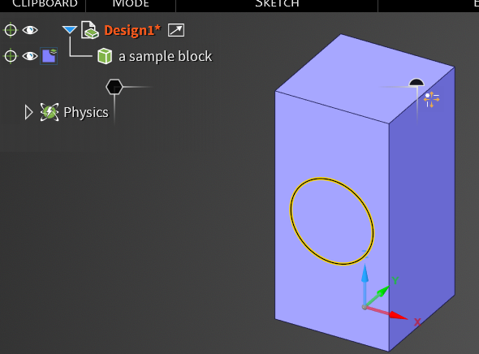
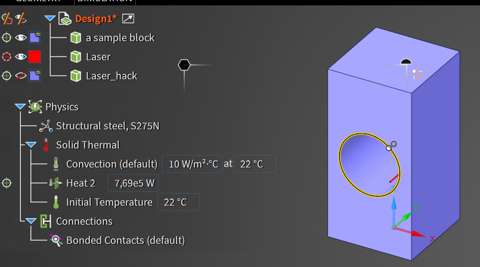
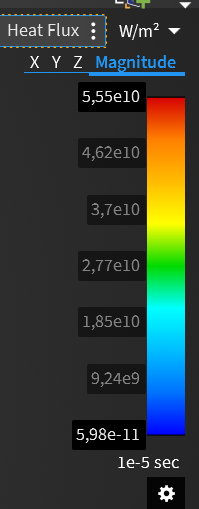
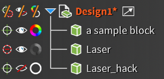

Das folgende Program erstellt einen Block und schneidet einen Kreis aus dem Block heraus; Dabei erstellt es eine Simulation.  
Grob geschieht folgendes:
- Block wird erstellt
- Loch wird in den Block geschnitten
- Ring wird auf den Schnitt gelegt (das wird im code als "laser_hack" oder ähnliches beschrieben)
- Simulation wird aufgebaut
- Simulation wird gestartet

# Verwendung
1. Navigiere zum Ribbon-Element "Discovery BasicTemplate3" und click auf "Create Block"
2. Erstelle einen Kreis auf dem Block und wähle den Kreis aus 
3. Navigiere zum Ribbon-Element "Discovery BasicTemplate3" und click auf "Simulate". Es sollte wie folgt aussehen: (Es könnte etwas brauchen, bis alles erstellt wurde)

[!NOTE]  
Der "Simulate" Button sollte auch die Simulation starten, allerdings funktioniert das manchmal nicht. Wenn die Simulation nicht gestartet wurde, starte sie manuel mit dem Knopf unten rechts.

---
Wenn die Simulation fertig ist, kann man den Slider auf der rechten seite, oben oder unten, greifen und die Farbskalierung so anpassen. Das ist nützlich, weil man dadurch erst die Temperatur besser sieht.  

---
In der Treeview sollte es wie folgt aussehen:

Von links nach rechts machen die Knöpfe folgendes:
- Ob der Körper an der Simulation beteiligt ist oder nicht
- Ist der Körper sichtbar
- Ist die Simulation des körpers sichtbar
---
[!IMPORTANT]  
Nur wenn man die "Enterprise" Lizenz hat, kann man auch simulationen durchführen.